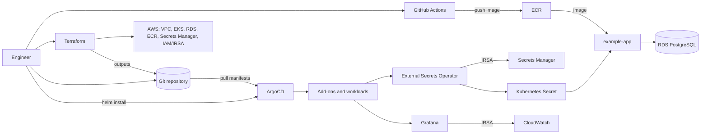

# eks-gitops-platform

[](https://github.com/mstrugarevic1/eks-gitops-platform/actions/workflows/checks.yml)

Reusable AWS EKS platform built with Terraform, ArgoCD App of Apps, Helm and
GitOps. Three environments — `dev`, `staging`, `production` — driven from one
component registry.

This is a learning and portfolio project. It is small on purpose: the point is a
deployment path another engineer can follow end to end, not a feature list.

## Architecture



More detail, including the sync waves and the IRSA roles, in
[docs/architecture.md](docs/architecture.md).

## Features

- Three environments from one component registry; adding a fourth is a directory
  copy and one line of JSON.
- App of Apps: a single root Application per environment; children are generated,
  committed and applied in sync-wave order.
- Every chart version, provider version and tool version pinned.
- Database credentials never touch Terraform state or Git: Terraform creates an
  empty Secrets Manager entry, one command fills it, External Secrets reads it
  through IRSA.
- No AWS access key in the cluster. Every controller uses IRSA.
- Static validation that needs no AWS account, and live verification that fails
  loudly.
- A minimal runnable example application, not a placeholder image.

## Ownership

| Terraform owns | ArgoCD owns |
| -------------- | ----------- |
| VPC, subnets, routes, NAT and internet gateways | AWS Load Balancer Controller |
| EKS cluster and managed node groups | External Secrets Operator and its manifests |
| ECR | metrics-server |
| RDS and the empty Secrets Manager entry | Cluster Autoscaler |
| IAM and IRSA roles | observability stack (VictoriaMetrics, Loki, Promtail, Grafana) |
| CloudWatch alarms | the gp3 StorageClass |
| AWS-managed EKS add-ons, including EBS CSI | workload charts, including `example-app` |

The handover is a set of Terraform outputs written into
`gitops/environments/<env>/environment.json`, committed, and read by ArgoCD from
Git.

## Repository structure

```text
app/                             minimal example workload (Dockerfile + one Python file)
bootstrap/                       remote Terraform backend bootstrap
terraform/modules/               reusable AWS modules
terraform/envs/<env>/            per-environment Terraform root module
terraform/foundation/            optional GitHub OIDC role for pushing to ECR
deploy/argocd/install/           ArgoCD Helm values
deploy/observability/            shared observability values and dashboards
deploy/storage/                  shared storage manifests
gitops/base/components.json      component registry: what exists, which chart, which version
gitops/environments/<env>/       per-environment config and rendered Applications
gitops/apps/example-app/chart/   the example application chart
scripts/                         render, secret, verify and cleanup helpers
tests/                           unit tests for the renderer
docs/                            guides
```

## Quick start

```bash
make prerequisites
cp terraform/envs/dev/terraform.tfvars.example terraform/envs/dev/terraform.tfvars
# edit terraform.tfvars: project, region, and your real eks_public_access_cidrs

make bootstrap ENV=dev AWS_REGION=us-east-1 PROJECT=my-platform
make init ENV=dev && make plan ENV=dev && make apply ENV=dev
make kubeconfig ENV=dev
make configure-app-secret ENV=dev
make build-app ENV=dev TAG=0.1.0 && make set-image-tag ENV=dev TAG=0.1.0
make deploy-argocd ENV=dev
make configure-gitops-values ENV=dev && make gitops-validate ENV=dev
git add gitops/ && git commit -m "chore: configure dev" && git push
make configure-argocd-repository ENV=dev SSH_KEY_FILE=~/.ssh/argocd_deploy_key
make apply-argocd-apps ENV=dev
make verify ENV=dev
```

Expect 20-30 minutes, most of it EKS and RDS.

**The `git push` is required.** ArgoCD reconciles the remote repository, not your
working copy.

## Full deployment guide

Step by step, with what each command does and what it needs:
[docs/deployment.md](docs/deployment.md).

## Verification

```bash
make check          # static, no AWS account needed
make verify ENV=dev # live, needs a running cluster
```

What each covers, plus a raw `kubectl`/`argocd` smoke test:
[docs/validation.md](docs/validation.md).

## Adding an environment

```bash
cp -R terraform/envs/dev terraform/envs/sandbox
cp -R gitops/environments/dev gitops/environments/sandbox
```

Register it in `gitops/environments/environments.json`, update the copied
`clusterName`, `secretManagerPath`, `valuesFile` and `vpc_cidr`, add
`gitops/apps/example-app/chart/values-sandbox.yaml`, then
`make gitops-render ENV=sandbox`. Validation rejects an environment that still
references another one. Details in [docs/deployment.md](docs/deployment.md).

## Adding an application

Put the chart in `gitops/apps/<name>/chart/`, register it in
`gitops/base/components.json` with a sync wave and a pinned version, enable it per
environment, and render. Field reference in [docs/gitops.md](docs/gitops.md).

## Enabling add-ons

Edit `addons` in `gitops/environments/<env>/environment.json`:

```json
{
  "addons": {
    "storageclass": true,
    "metricsServer": true,
    "awsLoadBalancerController": true,
    "clusterAutoscaler": true,
    "externalSecrets": true,
    "observability": false
  }
}
```

Then `make gitops-render ENV=dev`, validate, commit and push.

## Secrets

```text
Terraform creates an empty secret at <project>/<environment>/example-app
  -> make configure-app-secret fills it from the RDS-managed master secret
  -> External Secrets Operator reads it through IRSA
  -> a Kubernetes Secret appears in the application namespace
  -> the pod consumes it with envFrom
```

No database password reaches Terraform state or Git. Keys created, rotation and
the full flow: [docs/secrets.md](docs/secrets.md).

## CI and validation

`make check` runs the local subset: Terraform formatting, JSON parsing, GitOps
rendering and its determinism check, unit tests, shellcheck, Helm lint and
template.

CI adds `terraform init/validate/tflint` per environment, Checkov, `shfmt`,
`ruff`, `kubeconform` against the rendered manifests including CRDs, `actionlint`,
markdownlint, local documentation link checking and Gitleaks. It needs no AWS
credentials and runs with read-only permissions.
Details: [docs/validation.md](docs/validation.md).

## Cleanup

```bash
make destroy-gitops ENV=dev   # first: lets the controllers delete their ALBs
make destroy ENV=dev          # then: Terraform
```

The backend bucket is never deleted automatically. Order, destructive defaults
and what to do when destroy fails: [docs/cleanup.md](docs/cleanup.md).

## Troubleshooting

Symptom, cause, verification command, fix, for the failures that actually happen:
[docs/troubleshooting.md](docs/troubleshooting.md).

## Security considerations

- Nothing in the cluster holds an AWS access key; controllers use IRSA, each role
  scoped to what it needs. The External Secrets role can read one secret ARN.
- The EKS API endpoint is public and restricted only by
  `eks_public_access_cidrs`. Set it to a real address, or turn the public
  endpoint off and reach the API over a VPN.
- ArgoCD is installed with its built-in admin user, no ingress and no SSO. Add
  SSO and RBAC before more than one person uses it.
- Nodes and RDS run in private subnets; only the ALB is internet-facing.
- The example application runs non-root as UID 10001, with a read-only root
  filesystem, all capabilities dropped and `RuntimeDefault` seccomp.
- Gitleaks runs on every pull request. Credentials, kubeconfigs and
  `terraform.tfvars` are gitignored.

Reporting and known weak defaults: [SECURITY.md](SECURITY.md).

## Cost considerations

Largest recurring charges first: NAT gateways (hourly per gateway,
`nat_gateway_strategy = "per_az"` multiplies this by the AZ count), RDS (doubled
by `rds_multi_az`), the EKS control plane, ALBs, and the EC2 nodes held by
`node_min_size`.

For a demo environment: `nat_gateway_strategy = "single"`, `rds_multi_az = false`,
`db.t4g.micro`, `node_min_size = 1`, and tear it down the same day. An
environment left running overnight costs real money.

## Limitations

- Not deployed and verified against a live AWS account as part of this
  repository's checks. CI is static only.
- `make check` proves the configuration is internally consistent. It does not
  prove that AWS quotas, IAM permissions or live reconciliation are correct.
- ArgoCD is installed with Helm, not GitOps, and is not self-managed.
- ArgoCD repository credentials are created by a command, not committed.
- `production` keeps `automated.prune` disabled, so removing a component there
  leaves its resources behind on purpose.
- The example application exists to exercise the platform. Replace it with a real
  workload.
- Observability retention, dashboards and alerting rules are minimal.

## Roadmap

- Self-managed ArgoCD, so its own configuration is reconciled from Git.
- ArgoCD ingress with TLS, SSO and RBAC.
- Private EKS API endpoint with VPN access as the documented default.
- Terraform plan on pull requests through the existing OIDC role.
- Alerting rules and notification routing for the observability stack.
- Karpenter as an alternative to Cluster Autoscaler.

## License

[MIT](LICENSE). Contributing guidelines: [CONTRIBUTING.md](CONTRIBUTING.md).
