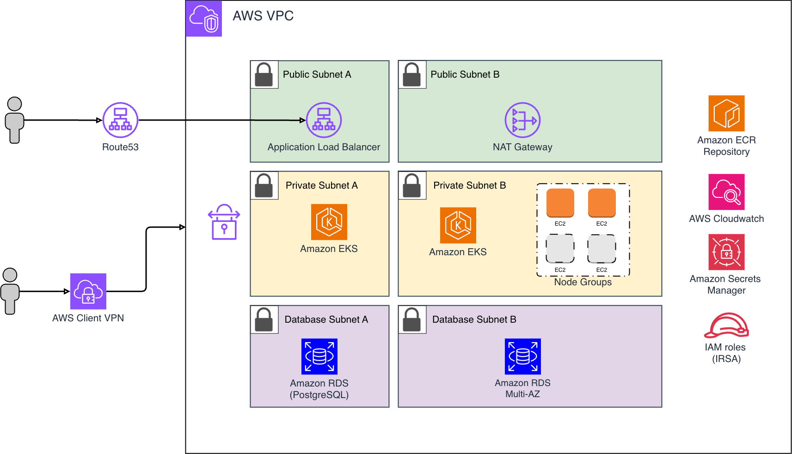

# Multi-Environment AWS EKS GitOps Platform

This repository deploys isolated `dev`, `staging`, and `production` AWS
environments using the same Terraform and GitOps architecture with
environment-specific configuration.

This is a personal learning and practice project provided as-is. Review
security, availability, and cost settings before using it outside disposable
environments.

Terraform provisions AWS infrastructure. ArgoCD manages Kubernetes add-ons and
workloads after each EKS cluster exists. The sample application exists only to
validate the platform end to end.

## Overview

Each environment has its own Terraform variables, Terraform backend, AWS
resources, GitOps environment config, and rendered ArgoCD Applications.

| Terraform | ArgoCD |
| --- | --- |
| VPC, public, private, and database subnets | AWS Load Balancer Controller |
| Routing and NAT | Cluster Autoscaler |
| EKS cluster and managed node groups | External Secrets Operator |
| AWS Client VPN | metrics-server |
| RDS PostgreSQL | Grafana, VictoriaMetrics, Loki, and Promtail |
| ECR | sample application |
| Secrets Manager entries | |
| IAM and IRSA roles | |
| CloudWatch resources | |

## Architecture



## Environments

The environment list is defined in
`gitops/environments/environments.json`.

```text
dev
staging
production
```

Terraform examples live in `terraform/environments/`. GitOps environment config
lives in `gitops/environments/<env>/environment.json`.

## Deployment

Start with `dev`, then repeat the same commands with `ENV=staging` or
`ENV=production` after creating the matching tfvars file.

```bash
make prerequisites
cp terraform/environments/dev.tfvars.example terraform/environments/dev.tfvars
make bootstrap ENV=dev AWS_REGION=us-east-1 PROJECT=my-platform
make init ENV=dev
make validate ENV=dev
make plan ENV=dev
make apply ENV=dev
make kubeconfig ENV=dev
make configure-app-secret ENV=dev
make deploy-argocd ENV=dev
make configure-gitops-values ENV=dev
make gitops-validate ENV=dev
make apply-argocd-apps ENV=dev
make verify ENV=dev
```

Private repositories also need ArgoCD repository credentials:

```bash
make configure-argocd-repository ENV=dev SSH_KEY_FILE=~/.ssh/argocd_deploy_key
```

## Validation

```bash
make fmt-check
make check
terraform -chdir=terraform/stack init -backend=false
terraform -chdir=terraform/stack validate
terraform -chdir=terraform/foundation init -backend=false
terraform -chdir=terraform/foundation validate
```

The CI workflow also runs TFLint, Checkov, Ruff, ShellCheck, Helm lint,
kubeconform, actionlint, markdownlint, and Gitleaks.

## Documentation

- [Configuration](docs/configuration.md)
- [Deployment](docs/deployment.md)
- [Troubleshooting](docs/troubleshooting.md)
- [Sample application](app/README.md)

## Cleanup

Destroy Kubernetes-managed resources before Terraform-managed AWS resources:

```bash
make destroy-gitops ENV=dev
make destroy ENV=dev
```

Destroy the Terraform backend only after the environment state is no longer
needed:

```bash
./bootstrap/destroy-bootstrap.sh my-platform dev us-east-1 DELETE_TERRAFORM_BACKEND
```

## Pending Improvements

- Replace placeholder AWS account IDs, certificate ARNs, VPC IDs, role ARNs,
  and image repository values before applying an environment.
- Validate the full flow in real AWS accounts for `dev`, `staging`, and
  `production`.

## Disclaimer

This repository is provided as-is. No guarantee is made regarding correctness,
security, availability, compatibility, cost, or operational outcome.
