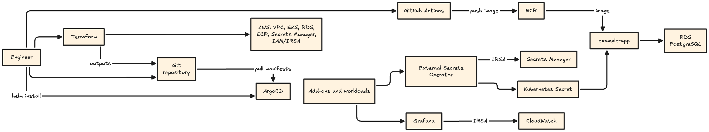

# Architecture

## Ownership boundary

Two systems own infrastructure, and they never overlap:

- **Terraform** owns everything in AWS: VPC, EKS, node groups, RDS, ECR, IAM and
  IRSA roles, the empty Secrets Manager entry, CloudWatch alarms, and the
  AWS-managed EKS add-ons.
- **ArgoCD** owns everything inside the cluster: controllers, the observability
  stack, `ExternalSecret` manifests and workloads.

The handover between them is a set of Terraform outputs written into
`gitops/environments/<env>/environment.json` by `make configure-gitops-values`.
That file is committed, and ArgoCD reads it from Git.

## Flow

## Sync waves

ArgoCD applies child Applications in wave order, so dependencies exist before
the things that need them.

| Wave | Component | Why here |
| ---- | --------- | -------- |
| -10 | storageclass | gp3 must exist before any PVC is created |
| -5 | metrics-server, AWS Load Balancer Controller, Cluster Autoscaler, External Secrets Operator | controllers and CRDs before the objects that use them |
| 0 | ExternalSecret manifests | needs the ESO CRDs from wave -5 |
| 10 | VictoriaMetrics stack, Loki, Promtail | needs storage and metrics-server |
| 11 | Grafana dashboards and datasources | needs the Grafana from wave 10 |
| 20 | example-app | needs the Kubernetes Secret from wave 0 and the ALB controller from wave -5 |

## Networking

One VPC per environment, public and private subnets across the configured AZs.
Nodes and RDS run in private subnets. The ALB the controller creates is
internet-facing in the public subnets.

`nat_gateway_strategy` decides the cost/availability trade-off:

- `single` — one NAT gateway for the whole VPC. Cheaper, but losing that AZ cuts
  outbound traffic for every private subnet.
- `per_az` — one NAT gateway per AZ. Each one carries its own hourly charge.

The EKS API endpoint is public and restricted to `eks_public_access_cidrs`.

## Identity

Nothing in the cluster holds an AWS access key. Each controller has its own IAM
role assumed through IRSA:

| Service account | Namespace | Grants |
| --------------- | --------- | ------ |
| `aws-load-balancer-controller` | `kube-system` | create and manage ALBs and target groups |
| `cluster-autoscaler` | `kube-system` | describe and scale the node group ASG |
| `external-secrets` | `external-secrets` | read the one application secret |
| Grafana | `observability` | read CloudWatch metrics |

The External Secrets role is scoped to the single secret ARN, not to Secrets
Manager as a whole.
